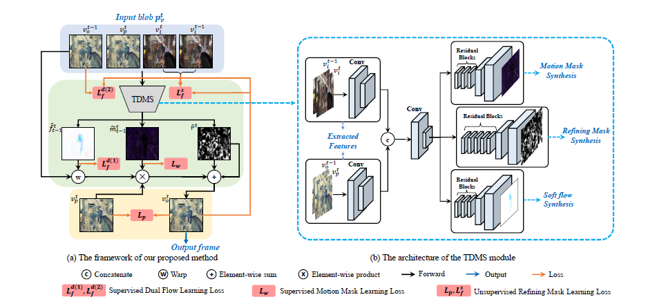
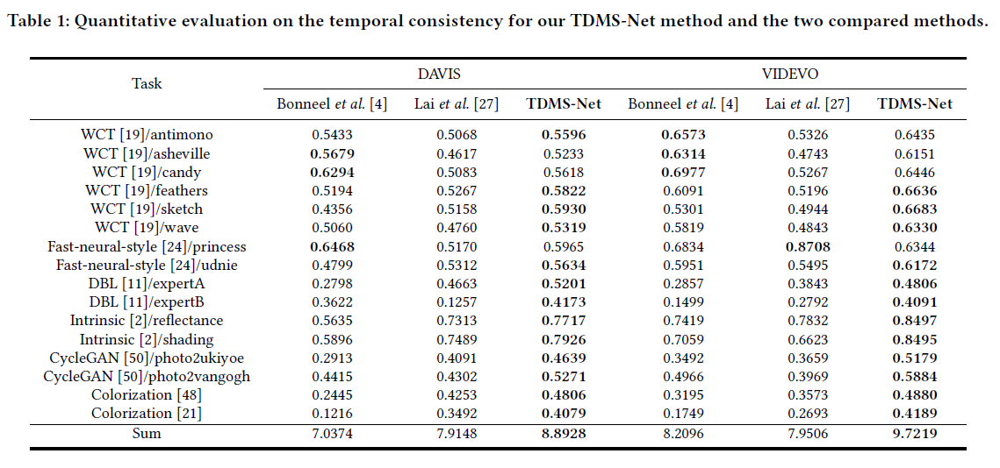
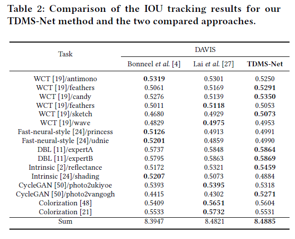
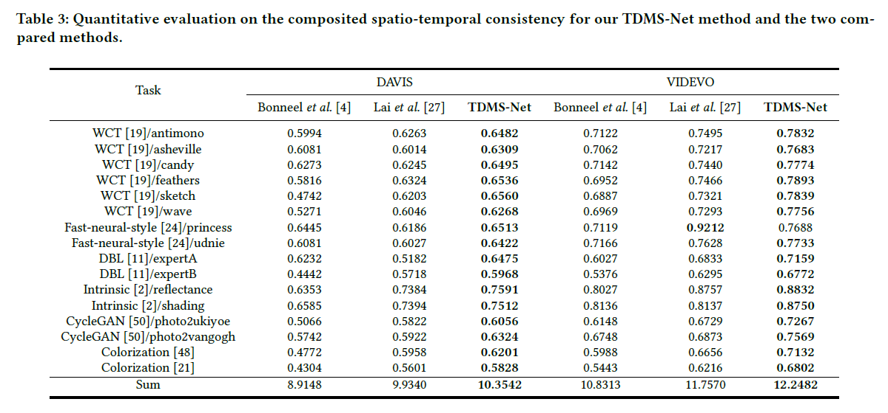

# TDMS-Net
Temporal Denoising Mask Synthesis Network for Learning Blind Video Temporal Consistency

**This paper has been accepted as a full research paper for presentation at the ACM Multimedia 2020 conference.**
[paper](https://dl.acm.org/doi/10.1145/3394171.3413788)

Simply using the image-based algorithm to process the frame sequence independently always leads the unstable
problems, shown in left part of animations. Our model takes the flicking frames as input and produces it’s coherent
version. Our results are on the **right part** while the compared results are on the **left part**.
<p align='center'>  
    
  
</p>

<p align='center'>
  
  
</p>

## Introduction
This is some source code and additional visualization examples of our TDMS-Net, *Temporal Denoising Masks Synthesis Network for Learning Blind Video Temporal Consistency*.

**Motivation of Our Work**

Simply using the image-based method to solve the video processing task frame-by-frame may always lead the temporal consistent problem. Given unstable pre-processed frames, solving the flickering problem is viewed as a temporal dimension denoise task. Our ternary temporal denoising mask synthesis network (TDMS-Net) is proposed to predict the motion mask, soft optical flow and the refining mask to construct our target frame. The TDMS-Net learns the temporal consistency from the original video and apply the learned temporal feature to reprocess the output frames of image-based method. The TDMS-Net is blind to the pre-process method. 

**Insight of Our Work**
1. We present the TDMS-Net, a three-stream temporal consistency learning network, which takes use of the flow, motion mask and refining mask to synthesize the high-quality and coherent frame sequence.
2. Our model is blind to the pre-processed method, in another words, each image-based translation methods can cast their results to the video level in our model.
3. The dual flow is used to teach our model to process the foreground area and background area separately. By this way the model can modify the pre-processed frames accurately while other methods solve the problem roughly.
4. A new metric based on the video tracking method is proposed to evaluate the enhancement effect of our model perceptual aspect and temporal aspect.
<p align='center'>  
    
</p>

## results
More quantity results can be found in [results.xlsx](results).
<p align='center'>
    
</p>

<p align='center'>  
    
</p>

<p align='center'>  
    
</p>

The pretrained model is upload to the BaiduDisk:
- url:https://pan.baidu.com/s/1HRk7zRQaGhdYl3HidLSuxw 
- code:eb8b 

To reproduce the results reported in the paper:
1. FlowNet2.0, refer to [flownet2-pytorch](https://github.com/NVIDIA/flownet2-pytorch)
2. The data prepared could refer to [fast blind video consistency](https://github.com/phoenix104104/fast_blind_video_consistency)
3. For single task such as: WCT/WAVE, run:

```python
python test_TDMS_Net.py --name TDMS --dataset DAVIS --data_dir your/dataset/path --model TDMSNet --phase test --task WCT/wave --checkpoints_dir ./checkpoints/TDMS_Net --which_epoch 65
```

To synthesize all the task results run:

```python
python batch_test.py --name TDMS --which_epoch 65 --data_dir your/dataset/path --checkpoints_dir ./checkpoints/
```

If you find this implementation useful in your work, please acknowledge it appropriately and cite the paper:

```
@inproceedings{TDMS-MM2020,
	author = {Zhou, Yifeng and Xu, Xing and Shen, Fumin and Gao, Lianli and Lu, Huimin and Shen, Heng Tao},
	title = {Temporal Denoising Mask Synthesis Network for Learning Blind Video Temporal Consistency},
	year = {2020},
	booktitle = {Proceedings of the 28th ACM International Conference on Multimedia},
	pages = {475–483},
}
```

```
@inproceedings{Lai-ECCV-2018,
    author    = {Lai, Wei-Sheng and Huang, Jia-Bin and Wang, Oliver and Shechtman, Eli and Yumer, Ersin and Yang, Ming-Hsuan}, 
    title     = {Learning Blind Video Temporal Consistency}, 
    booktitle = {European Conference on Computer Vision},
    year      = {2018}
}
```